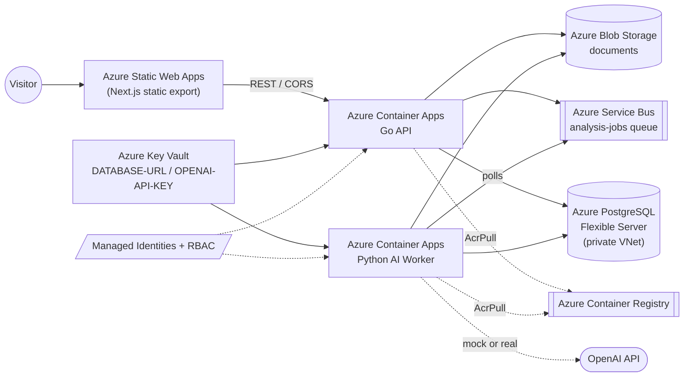

# LegalMove Pro

AI-assisted contract amendment review: compare an original agreement with an amendment and surface structured changes, risks, and human-review recommendations.

> **AI-generated review support. Not legal advice. All outputs should be reviewed by a qualified human.**

## Public demo (Azure)

| Resource | URL |
|----------|-----|
| Frontend | https://witty-bush-05c2c6e10.7.azurestaticapps.net (Azure Static Web Apps) |
| API | https://ca-api-legalmove-pro-dev.proudbeach-112d6306.centralus.azurecontainerapps.io (Azure Container Apps) |

Re-derive the live URLs with `terraform output -raw frontend_static_web_app_url` /
`terraform output -raw api_container_app_url` from `infra/terraform/azure/environments/dev`.
The worker runs in **mock mode** for the demo (synthetic results, no OpenAI spend) — see
[Demo mode](#demo-mode-mock-vs-real-openai) below.

- **Try it**: open the frontend, upload an original contract + amendment PDF, watch it go
  `PROCESSING → COMPLETED`, and review the structured result. Full walkthrough, checklist, and
  troubleshooting: [`docs/demo-runbook.md`](docs/demo-runbook.md).
- **How it's built**: [`docs/architecture-azure.md`](docs/architecture-azure.md) (diagram, resource
  inventory, API routes).
- **QA evidence**: [Milestone 5.3 — Public demo QA](docs/milestone-5.3-public-demo-qa.md).
- **Portfolio summary + known limitations**: [`docs/milestone-5.4-demo-package.md`](docs/milestone-5.4-demo-package.md).

## Architecture overview



Full diagram, resource inventory, and env-var/secret contract:
[`docs/architecture-azure.md`](docs/architecture-azure.md).

**Tech stack**: Go API (chi router) · Python AI worker (OpenAI pipeline) · Next.js frontend
(static export) · PostgreSQL · Azure Container Apps · Azure Static Web Apps · Azure Blob
Storage · Azure Service Bus · Azure Key Vault · Azure Container Registry · Managed
Identity/RBAC.

## Main features

- Upload an **original contract** + its **amendment** (PDF or image).
- AI-assisted review: a 6-step pipeline (vision parsing → contextualization → extraction →
  validation → mapping) compares the two documents.
- **Structured legal change output**: executive summary, per-change risk level, before/after
  text, evidence citations (`FinalAnalysisReport` v1 — see
  [Milestone 2.2](docs/milestone-2.2-granular-legal-output.md)).
- **Human-review recommendations** and validation warnings surfaced alongside the summary.
- **Raw JSON auditability** — the full structured payload is viewable in the UI for every
  completed analysis.

## Stack

| Component | Path | Role |
|-----------|------|------|
| Go API | `apps/api-go` | Upload documents, create analysis jobs, serve results |
| Python Worker | `apps/worker-ai` | Poll queue, materialize documents, run AI pipeline |
| Next.js Frontend | `apps/web` | Upload UI, job polling, result view |

PostgreSQL is the **source of truth** for jobs, documents, results, and statuses. Cloud storage and queues are optional extensions (local defaults below; Azure is the active deployment target).

## Quick start (local)

```bash
# 1. Environment
cp .env.example .env

# 2. PostgreSQL
docker compose up -d
docker exec -i legalmove-postgres psql -U legalmove -d legalmove \
  < apps/api-go/migrations/000001_init.up.sql
docker exec -i legalmove-postgres psql -U legalmove -d legalmove \
  < apps/api-go/migrations/000002_detected_changes_granular.up.sql
docker exec -i legalmove-postgres psql -U legalmove -d legalmove \
  < apps/api-go/migrations/000003_document_storage_provider.up.sql
docker exec -i legalmove-postgres psql -U legalmove -d legalmove \
  < apps/api-go/migrations/000004_allow_azure_storage_provider.up.sql

# 3. API
mkdir -p apps/api-go/uploads
cd apps/api-go && go run ./cmd/server

# 4. Worker (separate terminal)
cd apps/worker-ai
python -m venv .venv && source .venv/bin/activate
pip install -r requirements.txt
PYTHONPATH=src python src/main.py

# 5. Frontend (separate terminal)
cd apps/web && npm install && npm run dev
```

Open http://localhost:3000. API health: `curl -s http://localhost:8080/health`.

### Local defaults

```env
STORAGE_PROVIDER=local
QUEUE_PROVIDER=postgres
UPLOADS_DIR=./uploads
WORKER_USE_MOCK_RESULT=false   # set true to skip OpenAI during worker QA
```

## Demo mode (mock vs real OpenAI)

The worker has two modes, toggled by one env var (`WORKER_USE_MOCK_RESULT` locally,
`worker_use_mock_result` in Terraform):

| Mode | Behavior | Requires |
|------|----------|----------|
| **Mock** (`true`, default on the public demo) | Skips OpenAI entirely, returns a synthetic but schema-complete `FinalAnalysisReport` v1 | Nothing — no API key |
| **Real** (`false`) | Runs the full 6-step OpenAI pipeline | `OPENAI_API_KEY` (local) or the `OPENAI-API-KEY` Key Vault secret (cloud) |

The **public Azure demo runs in mock mode** so it can be shared freely with no OpenAI spend.
See [`docs/demo-runbook.md`](docs/demo-runbook.md) for how to flip it to real mode.

## Local vs cloud run modes

| | Local | Cloud (Azure) |
|---|---|---|
| Storage | Filesystem (`STORAGE_PROVIDER=local`) | Blob Storage (`azure_blob`) |
| Queue | PostgreSQL (`QUEUE_PROVIDER=postgres`) | Service Bus (`azure_service_bus`) |
| Database | Local Docker Postgres | Private PostgreSQL Flexible Server (VNet) |
| Frontend API URL | `NEXT_PUBLIC_API_BASE_URL` unset → falls back to `http://localhost:8080` | `NEXT_PUBLIC_API_BASE_URL` set to the Container App URL at build time |
| Worker AI mode | Real by default (set `WORKER_USE_MOCK_RESULT=true` to mock) | Mock by default on the public demo |

Switching between them is pure configuration — no code changes. See
[`docs/architecture-azure.md`](docs/architecture-azure.md) for the full cloud env-var/secret contract.

## Cloud-ready (legacy AWS: S3 + SQS)

Requires AWS dev resources and matching credentials. **New deployments target Azure** — see [Milestone 4.A](docs/milestone-4.a-azure-migration.md).

**API:**

```env
STORAGE_PROVIDER=s3
QUEUE_PROVIDER=sqs
AWS_REGION=us-east-1
S3_BUCKET=your-bucket
S3_PREFIX=dev
SQS_QUEUE_URL=https://sqs.us-east-1.amazonaws.com/ACCOUNT/queue-name
```

**Worker:**

```env
QUEUE_PROVIDER=sqs
AWS_REGION=us-east-1
S3_BUCKET=your-bucket
SQS_QUEUE_URL=https://sqs.us-east-1.amazonaws.com/ACCOUNT/queue-name
DOCUMENT_TEMP_DIR=./tmp/documents
```

`QUEUE_PROVIDER` must match between API and worker.

## Tests

```bash
# API
cd apps/api-go && go test ./... -count=1

# Worker
cd apps/worker-ai && PYTHONPATH=src .venv/bin/python -m pytest -q

# Frontend (no npm test script)
cd apps/web && npm run lint && npm run build
```

## Cloud infrastructure (Terraform)

**Active provider: Azure** (Blocks 4.B–4.H complete). AWS work from Blocks 4.1–4.3 is archived under `infra/terraform/aws/`.

```bash
az login
az account set --subscription "<subscription-id>"

cd infra/terraform/azure/environments/dev
terraform init && terraform validate && terraform plan
```

See [Milestone 4.H — Cloud E2E closure](docs/milestone-4.h-cloud-e2e-closure.md), [Milestone 4.G — Cloud migrations + QA](docs/milestone-4.g-cloud-migrations-qa.md), [Milestone 4.F — Container Apps deploy](docs/milestone-4.f-container-apps-deploy.md), [Milestone 4.D — Container Apps Environment](docs/milestone-4.d-container-apps-environment.md), [Milestone 4.C — PostgreSQL + networking](docs/milestone-4.c-azure-postgres-networking.md), [Milestone 4.B — Azure foundation](docs/milestone-4.b-azure-foundation.md), and [Milestone 4.A — migration plan](docs/milestone-4.a-azure-migration.md).

Archived AWS docs: [4.1](docs/milestone-4.1-terraform-foundation.md), [4.2](docs/milestone-4.2-rds-networking.md), [4.3](docs/milestone-4.3-ecs-task-definitions.md).

**Cost controls & cleanup**: replica limits, mock mode, feature-flag toggles per resource, and
the `terraform destroy` path (⚠️ deletes the live public demo) are documented in
[`infra/terraform/azure/README.md`](infra/terraform/azure/README.md#cost-controls--teardown).

## Known limitations

- **Not legal advice** — outputs are AI-generated review support only; always reviewed by a human.
- **No authentication** — the API and public demo are fully open. Strategy to close this gap:
  [Milestone 6.1 — Auth strategy](docs/milestone-6.1-auth-strategy.md).
- **No custom domain** — Azure auto-generated hostnames only (`*.azurestaticapps.net`, `*.azurecontainerapps.io`).
- **No OCR for scanned PDFs** — text-based PDFs only; scanned/image-only PDFs are rejected with a clear error.
- **No advanced CI/CD** — GitHub Actions covers the frontend deploy only; API/worker images and
  migrations are pushed/run manually (see [`docs/demo-runbook.md`](docs/demo-runbook.md)).
- **No reaper for stale jobs** — a job stuck in `QUEUED` (e.g. a lost queue message) has no
  automatic timeout to mark it `FAILED`.
- `/health` checks the API process only, not PostgreSQL connectivity.

Full list with rationale: [`docs/milestone-5.4-demo-package.md`](docs/milestone-5.4-demo-package.md#known-limitations).

## Documentation

- [Milestone 6.1 — Auth strategy + multi-user data model](docs/milestone-6.1-auth-strategy.md) — Entra External ID decision, data model, authorization policy, block plan (Block 6.1)
- [`docs/architecture-azure.md`](docs/architecture-azure.md) — Azure architecture diagram, resource inventory, API routes
- [`docs/demo-runbook.md`](docs/demo-runbook.md) — demo walkthrough, operate (mock/real mode, rebuild/deploy, migrations), troubleshooting
- [Milestone 5.4 — Demo package + portfolio docs](docs/milestone-5.4-demo-package.md) — portfolio highlights, known limitations, screenshot guide, Milestone 5 closure (Block 5.4)
- [Milestone 2.3 — PDF native + S3/SQS](docs/milestone-2.3-pdf-native.md) — full architecture and block history
- [Milestone 3 — Frontend MVP](docs/milestone-3-frontend-mvp.md) — UI flows and local setup
- [Milestone 5.3 — Public demo QA](docs/milestone-5.3-public-demo-qa.md) — provision + deploy SWA, full public-demo QA, polish, troubleshooting (Block 5.3)
- [Milestone 5.2 — Frontend public deploy](docs/milestone-5.2-frontend-public-deploy.md) — GitHub Actions CI/CD, static export, CORS, deployment runbook (Block 5.2)
- [Milestone 5.1 — Azure Static Web Apps strategy](docs/milestone-5.1-azure-static-web-apps-strategy.md) — SWA strategy, Next.js compat, Terraform module, deploy runbook (Block 5.1)
- [Milestone 4.H — Cloud E2E closure](docs/milestone-4.h-cloud-e2e-closure.md) — E2E QA, limitations, Milestone 4 closure (Block 4.H)
- [Milestone 4.G — Cloud migrations + QA](docs/milestone-4.g-cloud-migrations-qa.md) — SQL migrations job + cloud E2E runbook (Block 4.G)
- [Milestone 4.F — Container Apps deploy](docs/milestone-4.f-container-apps-deploy.md) — API + Worker on Azure (Block 4.F)
- [Milestone 4.E — Azure adapters](docs/milestone-4.e-azure-adapters.md) — Blob + Service Bus Go/Python (Block 4.E)
- [Milestone 4.D — Container Apps Environment](docs/milestone-4.d-container-apps-environment.md) — Log Analytics, CAE, AcrPull RBAC (Block 4.D)
- [Milestone 4.C — Azure PostgreSQL + networking](docs/milestone-4.c-azure-postgres-networking.md) — VNet, private PostgreSQL, DATABASE-URL (Block 4.C)
- [Milestone 4.B — Azure Terraform foundation](docs/milestone-4.b-azure-foundation.md) — ACR, Blob, Service Bus, Key Vault (Block 4.B)
- [Milestone 4.A — Azure migration plan](docs/milestone-4.a-azure-migration.md) — cloud roadmap
- [Milestone 4.1–4.3 — AWS Terraform](docs/milestone-4.1-terraform-foundation.md) — archived reference

## Milestone status

Milestone 2.3 (Blocks 1–8) is **complete** for local and cloud-ready paths:

- PDF native parsing (worker)
- PDF + image upload (frontend)
- Local and S3 storage (API)
- S3 document materialization (worker)
- Postgres and SQS job queues
- PostgreSQL remains source of truth

**Milestone 4 — Azure deployment (preliminary): closed.**

- Block 4.A (AWS → Azure reorientation): architecture, archive AWS Terraform, roadmap — **done**
- Block 4.B (Terraform Azure foundation): RG, ACR, Blob, Service Bus, Key Vault, managed identities — **done**
- Block 4.C (PostgreSQL + networking): VNet, private PostgreSQL, `DATABASE-URL` in Key Vault — **done**
- Block 4.D (Container Apps Environment): Log Analytics, CAE VNet integration, AcrPull RBAC — **done**
- Block 4.E (Azure adapters): Blob + Service Bus in Go/Python, DB migration — **done**
- Block 4.F (Container Apps deploy): API + Worker on Azure — **done**
- Block 4.G (Cloud migrations + QA): Container Apps Job for SQL schema, E2E runbook — **done**
- Block 4.H (Cloud E2E QA + closure): validation, CORS config, limitations, Milestone 4 sign-off — **done**

**Milestone 5 — Frontend hosting + public demo: closed.**

- Block 5.1 (Azure Static Web Apps strategy + Terraform module): **done** — see [Milestone 5.1](docs/milestone-5.1-azure-static-web-apps-strategy.md)
- Block 5.2 (GitHub Actions CI/CD + static export + public deploy): **done** — see [Milestone 5.2](docs/milestone-5.2-frontend-public-deploy.md)
- Block 5.3 (public demo QA + polish): **done** — SWA provisioned + deployed, full E2E QA, CORS image fix, light copy polish — see [Milestone 5.3](docs/milestone-5.3-public-demo-qa.md)
- Block 5.4 (demo package + portfolio documentation): **done** — architecture doc, demo runbook, cost controls, troubleshooting, portfolio highlights, Milestone 5 sign-off — see [Milestone 5.4](docs/milestone-5.4-demo-package.md)

Archived AWS blocks (reference only): 4.1 (ECR/S3/SQS), 4.2 (VPC/RDS), 4.3 (ECS task defs). Dockerfiles remain reusable for Azure Container Apps.
