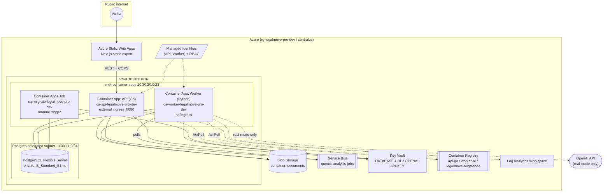

# Architecture — Azure (active deployment)

> Companion reference for [Milestone 5.4 — Demo package + portfolio documentation](milestone-5.4-demo-package.md).
> Describes the deployed system as of Milestone 5.3/5.4 closure. Source of truth for resource
> definitions is `infra/terraform/azure/`.

## Request/data flow

1. A visitor opens the **Next.js static export** hosted on **Azure Static Web Apps**.
2. The frontend calls the **Go API** (Azure Container Apps) over REST; CORS is scoped to the
   SWA hostname + `localhost:3000` (`internal/httpserver/cors.go`).
3. `POST /documents` stores the uploaded PDF/image in **Azure Blob Storage** and persists
   metadata in **PostgreSQL**.
4. `POST /analyses` creates a job row and enqueues a message on **Azure Service Bus**
   (`analysis-jobs` queue).
5. The **Python AI worker** (a separate Container App, no ingress) polls the queue, claims the
   job, materializes both documents from Blob Storage, and runs the 6-step analysis pipeline
   (mock or real OpenAI — see [Demo mode](../README.md#demo-mode-mock-vs-real-openai)).
6. The worker writes the `FinalAnalysisReport` v1 result back to PostgreSQL and marks the job
   `COMPLETED` (or `FAILED` / `NEEDS_REVIEW`).
7. The frontend polls `GET /analyses/{id}` every 3s until the job reaches a terminal status,
   then fetches `GET /analyses/{id}/result`.

PostgreSQL and the Container Apps subnet sit inside a **private VNet**; Postgres has no public
endpoint. Both the API and worker Container Apps authenticate to Blob Storage, Service Bus,
ACR, and Key Vault via **user-assigned Managed Identities** (no shared keys in app config).

## Diagram

## Resource inventory

| Resource | Terraform module | Name pattern | SKU / notes |
|---|---|---|---|
| Resource group | `resource_group` | `rg-legalmove-pro-dev` | — |
| Container Registry | `acr` | `lmprodevacr*` | Basic, managed-identity pull |
| Blob Storage | `blob_documents` | `lmprodev*` | LRS, `documents` container, 90-day lifecycle expiry |
| Service Bus | `service_bus_analysis` | `sb-lmpro-dev-*` | Standard, `analysis-jobs` queue + dead-letter subqueue |
| Key Vault | `key_vault` | `kv-lmpro-dev-*` | Standard, soft-delete 7d, purge protection off (dev) |
| Managed Identities | `managed_identities` | API + Worker | AcrPull, Blob Data Contributor, Service Bus Data Sender/Receiver |
| VNet + subnets | `networking` | `10.30.0.0/16` | Postgres subnet `/24`, Container Apps subnet `/23` |
| PostgreSQL Flexible Server | `postgres_flexible` | `psql-lmpro-dev-*` | `B_Standard_B1ms`, private, 32 GB, 7-day backups, DB `legalmove` |
| Container Apps Environment | `container_apps_environment` | `cae-legalmove-pro-dev` | Consumption profile, VNet-integrated |
| Log Analytics workspace | `container_apps_environment` | `log-legalmove-pro-dev` | 30-day retention |
| API Container App | `container_apps` | `ca-api-legalmove-pro-dev` | 0.5 vCPU / 1Gi, 1–2 replicas, external ingress, `/health` |
| Worker Container App | `container_apps` | `ca-worker-legalmove-pro-dev` | 1 vCPU / 2Gi, 1 replica fixed, no ingress |
| Migration job | `container_apps` (migration_job.tf) | `caj-migrate-legalmove-pro-dev` | Manual trigger, 300s timeout, image `legalmove-migrations:latest` |
| Static Web App | `static_web_app` | `swa-lmpro-dev-*` | Free tier, `centralus` |

## Env-var / secret contract

| Variable / secret | Where | Value |
|---|---|---|
| `DATABASE_URL` | API, Worker, Migration job | Key Vault secret `DATABASE-URL` |
| `OPENAI_API_KEY` | Worker | Key Vault secret `OPENAI-API-KEY` (only referenced when `worker_use_mock_result = false`) |
| `WORKER_USE_MOCK_RESULT` | Worker | `true` on the public demo; `false` for real analyses |
| `STORAGE_PROVIDER` | API | `azure_blob` in cloud, `local` locally |
| `QUEUE_PROVIDER` | API, Worker | `azure_service_bus` in cloud, `postgres` locally |
| `CORS_ALLOWED_ORIGINS` | API | `http://localhost:3000,https://<swa-hostname>` |
| `AZURE_CLIENT_ID` | API, Worker | Managed identity client ID (per app) |
| `NEXT_PUBLIC_API_BASE_URL` | Frontend build (GitHub Actions variable) | API Container App URL |

Full env mapping: [`infra/terraform/azure/README.md`](../infra/terraform/azure/README.md#application-env-mapping-container-apps--block-4f).

## API route reference

| Method | Path | Purpose |
|---|---|---|
| `GET` | `/health` | Process health check (does not verify DB connectivity) |
| `POST` | `/documents` | Upload a document (`multipart/form-data`: `file`, `document_role` = `ORIGINAL`\|`AMENDMENT`) |
| `POST` | `/analyses` | Create an analysis job (`original_document_id`, `amendment_document_id`) |
| `GET` | `/analyses` | List jobs (`limit` default 20, max 100; `offset`) |
| `GET` | `/analyses/{id}` | Get job status |
| `GET` | `/analyses/{id}/result` | Get the `FinalAnalysisReport` v1 result (404 until `COMPLETED`) |

Job statuses: `QUEUED → PROCESSING → COMPLETED` (or `FAILED` / `NEEDS_REVIEW`).

## Related docs

- [`docs/demo-runbook.md`](demo-runbook.md) — operate the demo day-to-day
- [Milestone 5.4 — Demo package](milestone-5.4-demo-package.md) — portfolio highlights + limitations
- [Milestone 4.F — Container Apps deploy](milestone-4.f-container-apps-deploy.md)
- [Milestone 4.C — PostgreSQL + networking](milestone-4.c-azure-postgres-networking.md)
- [Milestone 2.2 — Granular legal output](milestone-2.2-granular-legal-output.md) — `FinalAnalysisReport` v1 schema
- [`infra/terraform/azure/README.md`](../infra/terraform/azure/README.md)
